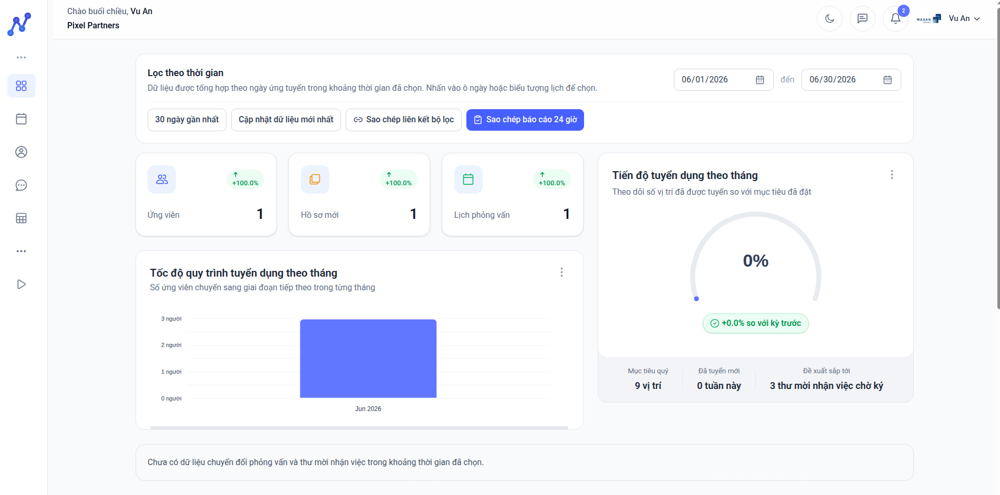
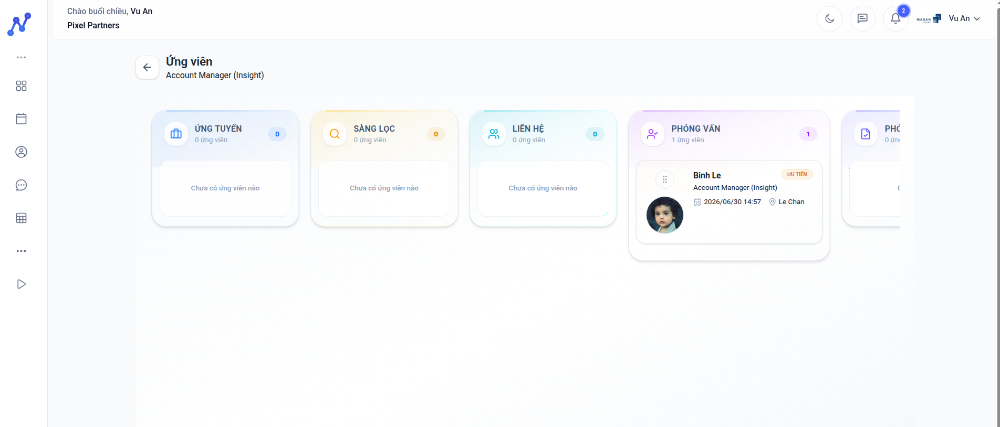
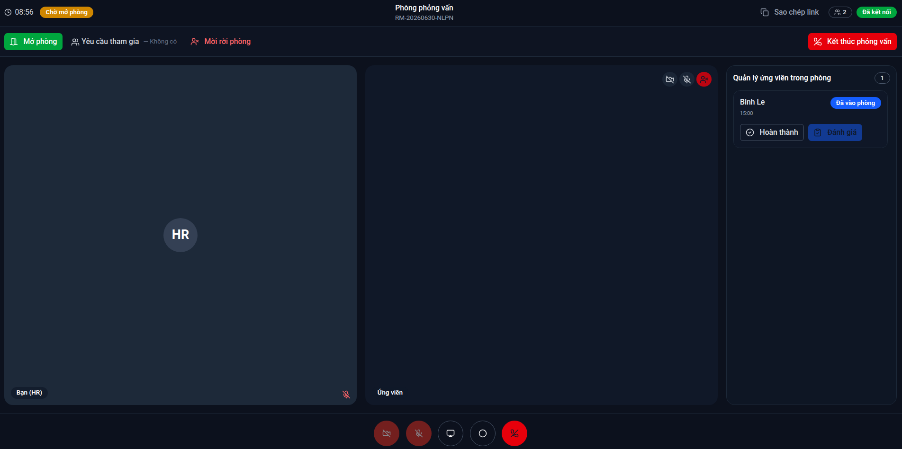
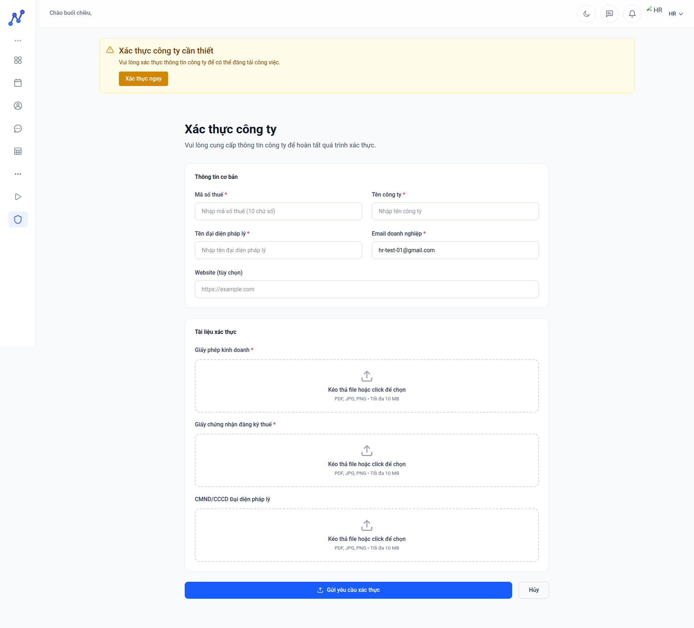

# CareerGraph HR

CareerGraph HR là workspace tuyển dụng dành cho doanh nghiệp trên nền tảng. Ứng dụng này kết hợp dashboard, ATS, interview operations, messaging và company onboarding trong một portal thống nhất cho đội ngũ tuyển dụng.


## Product scope

HR portal hiện bao gồm các nhóm chức năng:

- authentication và onboarding cho doanh nghiệp
- dashboard tuyển dụng
- quản lý hồ sơ công ty và xác thực doanh nghiệp
- quản lý job postings
- kanban ứng viên theo pipeline
- lịch phỏng vấn
- interview detail và interview room
- candidate suggestions
- messaging với ứng viên
- account và profile settings

## Product screens

Dashboard thống kê:



Kanban ứng viên theo pipeline:



Interview room cho điều phối phỏng vấn:



Workflow xác thực doanh nghiệp:



## Core capabilities

- vận hành dashboard KPI tuyển dụng theo khoảng thời gian
- đăng tuyển và quản lý job lifecycle
- kéo thả ứng viên theo pipeline tuyển dụng
- quản lý lịch, trạng thái và đề xuất đổi lịch phỏng vấn
- điều phối phỏng vấn trực tuyến với waiting room, admit/reject, recording và feedback
- nhắn tin realtime với ứng viên
- nộp và theo dõi xác thực doanh nghiệp
- nhận gợi ý ứng viên từ backend recommendation/search flows

## Technology

- React 19
- TypeScript
- Vite
- Tailwind CSS 4
- React Router
- TanStack Query
- Axios
- Socket.IO client
- FullCalendar
- dnd-kit
- ApexCharts
- Recharts
- Tiptap
- Radix UI

## Architecture

Portal này phụ thuộc trực tiếp vào:

- `careergraph-api`
- `careergraph-rtc`

`careergraph-api` cung cấp domain data và business rules; `careergraph-rtc` cung cấp signaling, realtime room behavior và presence-dependent workflows.

## Code structure

```text
src/
├── api/
├── components/
├── config/
├── context/
├── features/
│   ├── dashboard/
│   ├── messaging/
│   └── notifications/
├── hooks/
├── layout/
├── pages/
├── services/
├── stores/
├── types/
└── lib/
```

## Environment model

Cấu hình môi trường được cung cấp qua các biến `VITE_*` trong local development và qua build-time environment trong production.

Các biến quan trọng:

- `VITE_API_BASE_URL`
- `VITE_RTC_BASE_URL`
- `VITE_GOOGLE_CLIENT_ID`
- `VITE_CLIENT_SITE_URL`

Môi trường production nên được cấp qua secret manager hoặc CI/CD variables; file `.env` chỉ dùng cho local development.

## Local development

Yêu cầu:

- Node.js 20.19+ hoặc mới hơn
- npm
- `careergraph-api` và `careergraph-rtc` đang chạy

Chạy local:

```bash
npm install
npm run dev
```

Build production:

```bash
npm run build
```

## Deployment notes

- Portal được build thành static frontend và có thể phục vụ qua web server hoặc CDN
- Production configuration cần đồng bộ chặt với domain của API, RTC và candidate portal
- Interview room, dashboard analytics và editor-heavy modules là các khu vực nên tiếp tục theo dõi bundle size nếu ứng dụng mở rộng thêm

## Verification

- Build frontend đã hoàn tất thành công trong workspace hiện tại
- Bundle production hiện còn lớn, đặc biệt ở các luồng dashboard, interview và export-related dependencies
